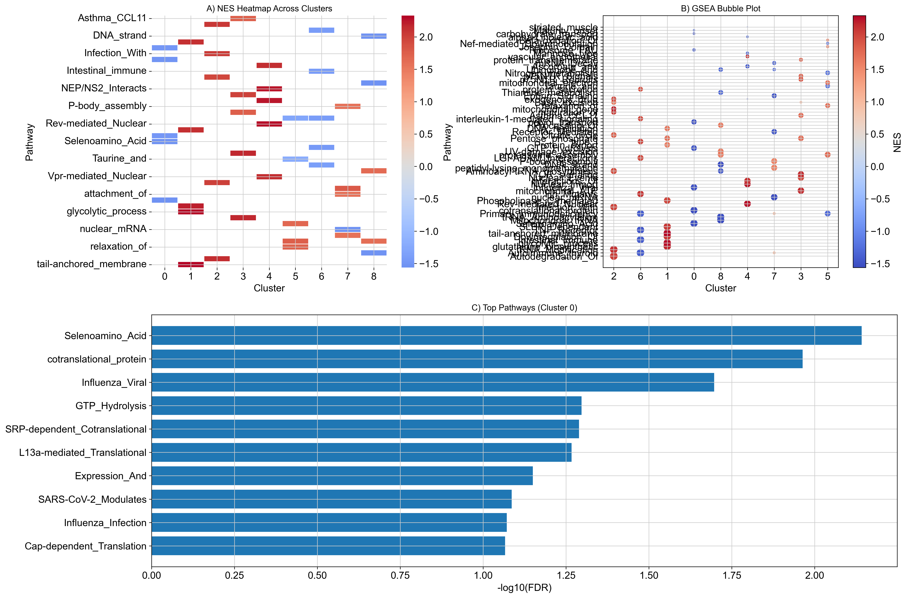

# 🧬 Single-Cell RNA-seq Analysis of Melanoma Monocytes

### *Reproducible Pipeline with Offline GSEA & Publication-Ready Figures*

---

## 🎯 Project Summary

Melanoma progression is strongly influenced by systemic immune reprogramming, particularly within circulating monocyte populations.

In this project, I performed a reproducible single-cell RNA-seq analysis to characterize transcriptional heterogeneity in CD14+ monocytes from melanoma samples.

The analysis reveals distinct functional states, including immunosuppressive signatures consistent with M-MDSC-like phenotypes, highlighting potential mechanisms of tumor-driven immune modulation.

In addition, I developed a fully offline Gene Set Enrichment Analysis (GSEA) workflow, enabling pathway-level interpretation in restricted computational environments.

---

## 🔬 Scientific Objectives

* Characterize transcriptional heterogeneity of monocyte populations
* Identify biologically meaningful clusters
* Reveal functional pathways using GSEA (KEGG, GO, Reactome)
* Generate publication-quality visualizations

---

## 🚀 Key Contributions

- Developed a fully reproducible end-to-end scRNA-seq pipeline for melanoma analysis  
- Identified functionally distinct monocyte subpopulations linked to tumor-associated immune modulation  
- Implemented a robust offline GSEA framework enabling pathway analysis without internet access  
- Integrated multi-database pathway analysis (KEGG, GO, Reactome) for biological interpretation  
- Generated publication-ready multi-panel visualizations  

---

## 📊 Highlight Results

### 🔹 Final Multi-panel Figure



---

## 🧪 Biological Insights

The analysis reveals significant functional heterogeneity among melanoma-associated monocytes:

- **Cluster 0**  
  Enriched in ribosomal and translational pathways, suggesting elevated biosynthetic activity and potential involvement in rapid cellular adaptation.

- **Cluster 8**  
  Enriched in immune and antiviral response pathways, indicating an activated or inflammatory monocyte state.

- **Global observation**  
  The presence of both metabolically active and immune-responsive subpopulations supports a model of dynamic monocyte reprogramming in melanoma.

These findings are consistent with emerging evidence of M-MDSC-like immunosuppressive phenotypes in cancer.

---

## 🔍 Why This Matters

Understanding how melanoma reshapes circulating monocytes is critical for:

- Identifying biomarkers of immune suppression  
- Improving immunotherapy response prediction  
- Revealing potential therapeutic targets  

This project demonstrates how reproducible single-cell analysis can bridge computational methods with clinically relevant biological insights.

---

## 🧠 Technical Highlights

This project demonstrates strong capabilities in:

* Bioinformatics pipeline design
* Data preprocessing and QC (Scanpy)
* High-dimensional data analysis
* Gene set enrichment analysis (GSEApy)
* Data visualization (Matplotlib, Seaborn)
* Debugging and optimization of real-world datasets
* Working in offline/restricted computational environments

---

## 📁 Project Structure

```
notebooks/       → step-by-step analysis pipeline
resources/       → offline gene sets (GMT files)
results/         → processed outputs (CSV)
figures/         → publication-quality figures
```

---

## ⚙️ Installation

```bash
pip install -r requirements.txt
```

---

## ▶️ Usage

Run notebooks sequentially:

```
01 → preprocessing  
02 → clustering  
03 → marker detection  
...  
07 → GSEA analysis  
```

---

## 💡 Reproducibility

* Fully reproducible pipeline
* Offline-compatible GSEA (no internet required after setup)
* Clean modular structure for reuse in other datasets

---

## 🧠 Author Perspective

With a background in molecular genetics, clinical laboratory work, and bioinformatics, this project reflects an integrated approach combining biological interpretation with computational rigor.

---

## 🎓 Research & Collaboration

I am actively seeking:

* Postdoctoral research opportunities
* Short-term research collaborations
* Bioinformatics and data analysis projects

---

## 📬 Contact

**Kavoos Momeni**
PhD in Molecular Genetics & Bioinformatics

* Email: kavoosmomeni@gmail.com
* LinkedIn: Kavoos Momeni

---

## ⭐ If you find this project useful

Please consider starring the repository to support further development.

---

